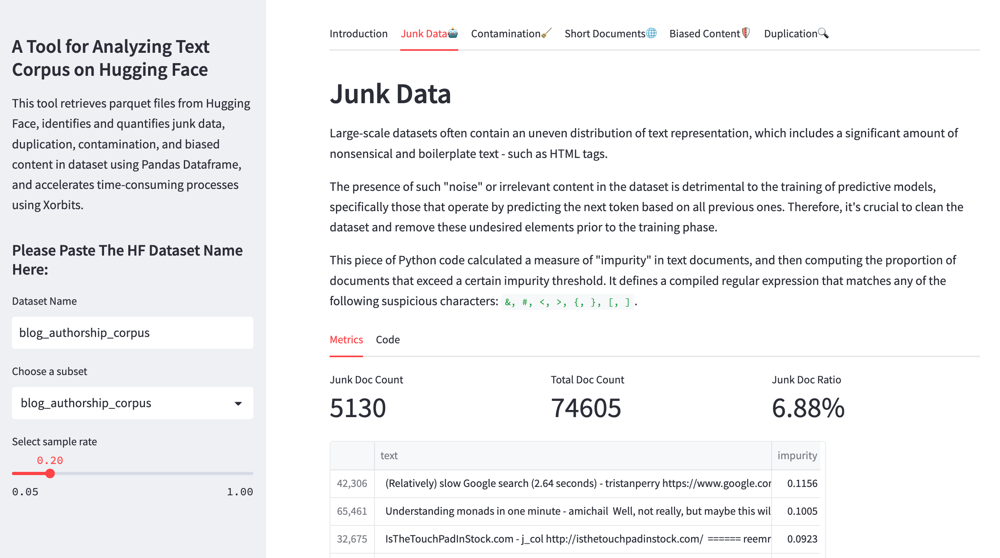

# Hugging Face Datasets Text Quality Analysis



The purpose of this repository is to let people evaluate the quality of datasets on Hugging Face. It retrieves parquet files from Hugging Face, identifies the junk data, duplication, contamination, biased content, and other quality issues within a given dataset.

## Related Resources

* [Google Colab Notebook](https://colab.research.google.com/drive/1c8rWB2gtUrBHQcmmvA_NAXxc7Cexn1vM?usp=sharing)

## Running the app
### Instructions

1. Prerequisites
Note that the code only works `Python >= 3.9` and `streamlit >= 1.23.1`

```
$ conda create -n datasets-quality python=3.9
$ conda activate datasets-quality
```

2. Install dependencies
```
$ cd HuggingFace-Datasets-Text-Quality-Analysis
$ pip install -r requirements.txt
```

3. Run Streamlit application
```
python -m streamlit run app.py
```

### Need to know

When the dataset you download from Hugging Face is too large, running the application may exceed the memory of your machine and causes some errors. Sample the data or refer to some libraries that can run Pandas on a cluster, such as Xorbits, Dask.


## Todos

- [ ] Introduce more dimensions to evaluate the dataset quality
  - Another indicator of poor quality data is excessive repetition of certain words or phrases within a document (Gopher)
- [ ] Optimize the deduplication example using parallel computing technique
- [ ] More robust junk data detecting 
- [ ] Use a classifier to evaluate the quality of data
- [ ] Test the code with larger dataset in a cluster environment
- [ ] More data frame manipulation backend: e.g. Dask
